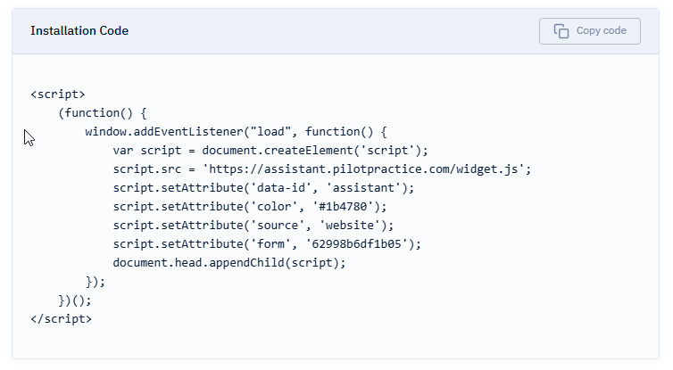
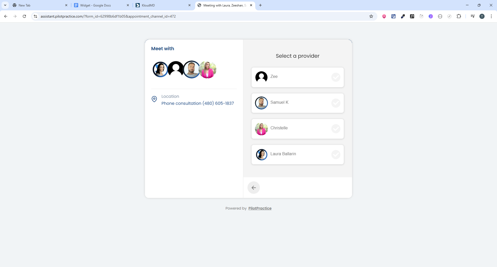
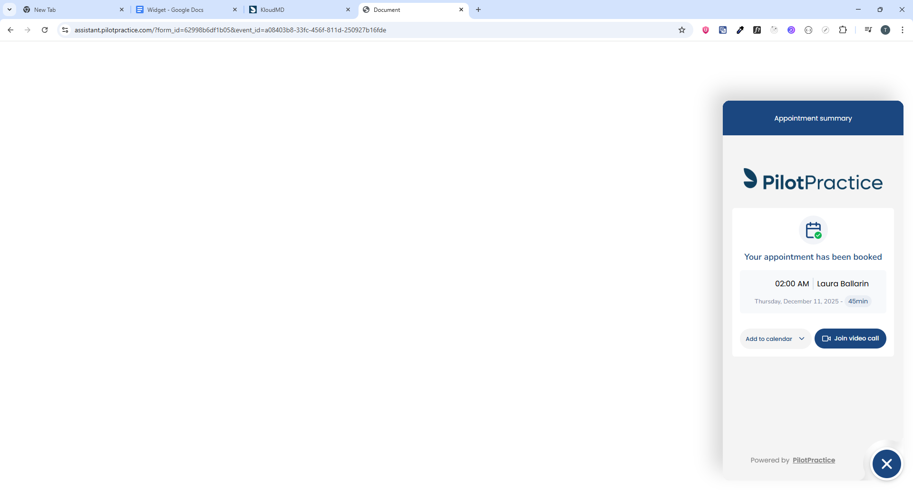
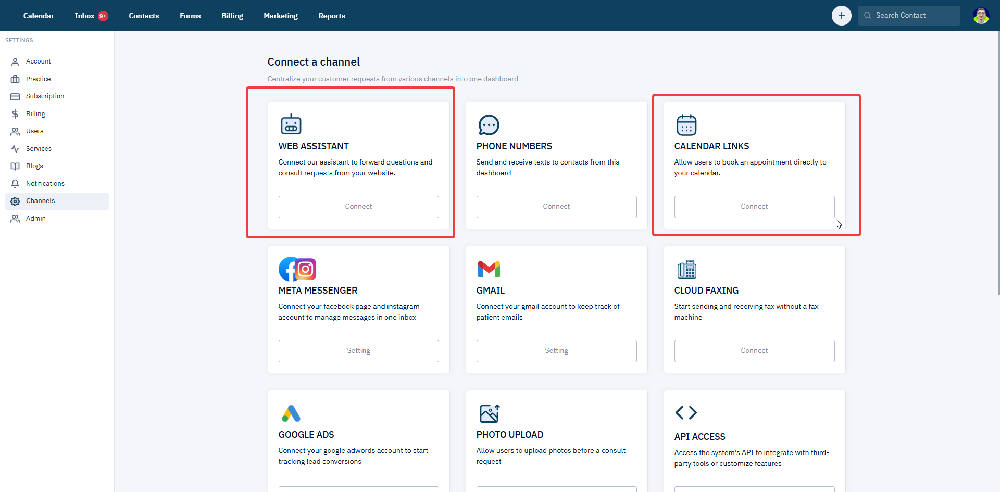
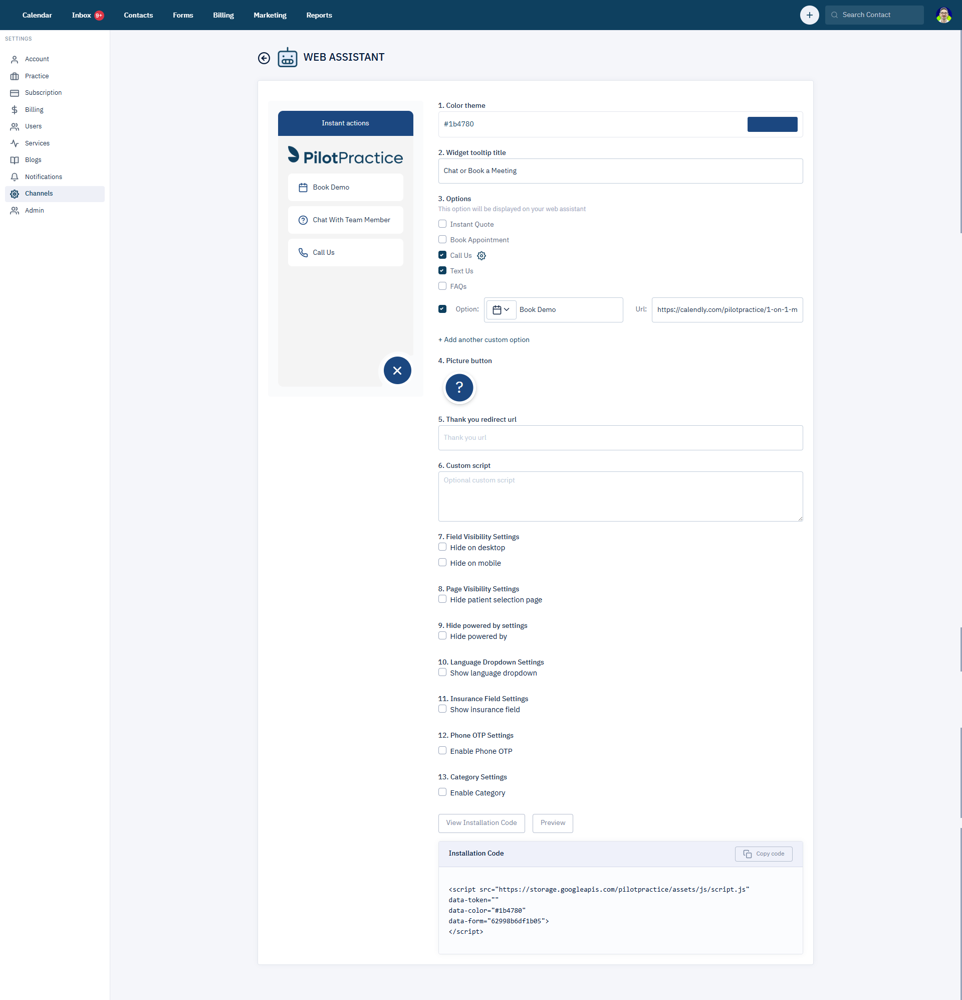

# WIDGET

- Link widget ví dụ: https://assistant.pilotpractice.com/?form_id=62998b6df1b05  
- Diagram: https://www.mermaidchart.com/d/074843d2-c0d6-4a7f-bb7c-c539dcdd5ded

## WIDGET TỔNG QUAN

- **Ngôn ngữ:** Javascript  
- Widget được nhúng vào website (thường là trang chủ) của các cơ sở thẩm mỹ/clinic (**mỗi cơ sở = 1 project**).  
- Tùy nhu cầu, mỗi project có thể chọn kiểu cài đặt (**installation type**) khác nhau.

## 1) EMBED

**Script Loader → load theo UUID**

Website nhúng 1 đoạn script loader.

- Loader nhận `uuid` của project  
- → gọi API để lấy config/data  
- → render widget

## 2) WIDGET OPTIONS & CUSTOM OPTIONS

### Options chính (main menu)
- Instant Quote
- Book Appointment
- Ask Question
- FAQs
- Call Us
- ...

### Custom options
- **Bản chất:** link redirect  
- **Logic:** mỗi custom option có behavior riêng dựa trên config

### Parameters
- `&full_page` → hiển thị widget full screen
- `&appointment_channel_id` → hiển thị widget dạng calendar link và select appointment channel cụ thể
- `&event_id=` → show trực tiếp event detail
- `?signature=<signature>&expires=<expires>` → confirm/cancel event
- `&staff_id` → auto-select staff, skip màn chọn staff
- `&procedure_id` → tương tự `staff_id`

### Attributes (script `data-*`)
- `data-click="instant-quote-now"`
- `data-click="schedule-consultation"`
- `data-click="faqs"`
- `data-click="text-us"`
- `data-click="call"`

Ngoài ra có các `data-*` khác để tự xử lý logic tương ứng.



## 3) FLOWS

### 3.1) Instant Quote Flow

User click → Gender? (**YES** chọn | **NO** skip) → Body Area? (**YES** chọn | **NO** skip) → Provider? (Use/Select/Skip) → Services (**REQUIRED**) → Interest (**REQUIRED**) → Name (**REQUIRED**) → Email (**REQUIRED**) → Phone (**REQUIRED**) → `[API: Create Lead]` → Quote Summary → Thank You

### 3.2) FAQs Flow

FAQs → `TOP_QUESTION` → list → click question → expand/collapse (mở 1 cái đóng cái khác) → "I have another question" → `ASK_QUESTION`

### 3.3) Call Us Flow

**Multiple phone numbers?**

- **YES** (`main_phone_number=false` AND `locations > 1`) → `LOCATION_CALL` → chọn location → `tel:` → END
- **NO** → ưu tiên số gọi:
  - `main_phone_number`
  - (1 location ? `locations[0].phone`) → `phoneToCall` → `tel:` → END

**Code**
```js
const phoneNumber =
  form?.main_phone_number ||
  (form?.locations?.length === 1 ? form?.locations[0]?.phone : null) ||
  phoneToCall;
```

### 3.4) Book Appointment Flow

#### A) CALENDAR

Collect info first? (`REQUEST_CONSULT` → OTP? → Login/Create Lead) hoặc direct booking

Location → Provider → Procedure → `SELECT_TIME` → Create Appointment/Register → Confirmed

#### B) FORM

`REQUEST_CONSULT` → OTP? → Category? → Create Lead → Summary → End

**Key flags**

- `appointment_request_type`
- `enable_category_selection`
- `is_phone_otp_enabled`
- `collect_patient_information_first_before_scheduling`

### 3.5) Ask Question Flow

`ASK_QUESTION` → nhập info → tick consent → Submit

**Flow types:**

- **Normal** → `POST /leads` → lead `step="question"` → End
- **Book Appointment mode** → `CONSULT_SUMMARY`

## 4) SETTINGS

Tất cả settings của widget được cấu hình ở 2 channel:
- Web Assistant
- Calendar Links


